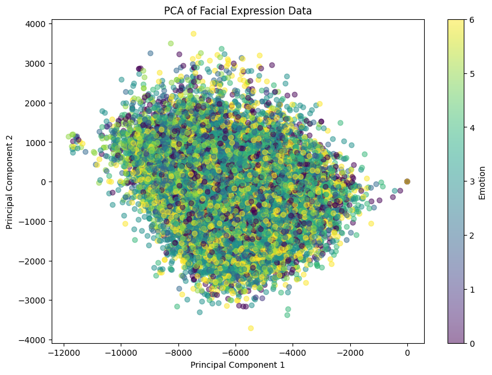
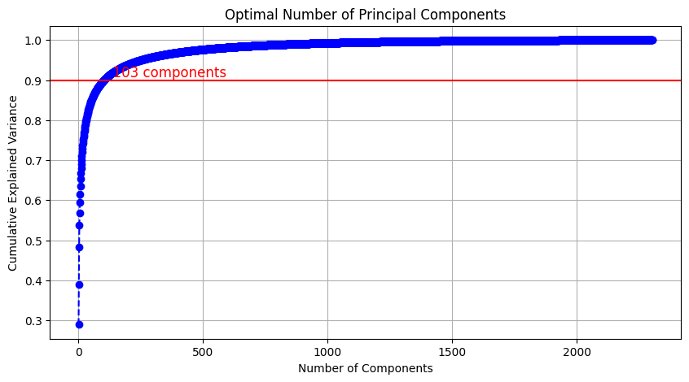

# Mini-Project for Fundamentals of Machine Learning Course

This repository contains the code and data for a mini-project on facial expression recognition using machine learning algorithms.

## 📑 Project Policy
- Team: group should consist of 3-4 students.

    |No.| Student Name    | Student ID |
    | --------| -------- | ------- |
    |1| Nguyễn Minh Trí | 21110417 |
    |2| Nguyễn Hoàng Nam | 21110459 |
    |3| Ngô Văn Trung | 21110423 |
    |4| Trà Hoàng Tuấn | 21110437 |

- The submission deadline is strict: **11:59 PM** on **June 22nd, 2024**. Commits pushed after this deadline will not be considered.

## 📦 Project Structure

The repository is organized into the following directories:

- **/data**: This directory contains the facial expression dataset. You'll need to download the dataset and place it here before running the notebooks. (Download link provided below)
- **/notebooks**: This directory contains the Jupyter notebook ```EDA.ipynb```. This notebook guides you through exploratory data analysis (EDA) and classification tasks.

## ⚙️ Usage

This project is designed to be completed in the following steps:

1. **Fork the Project**: Click on the ```Fork``` button on the top right corner of this repository, this will create a copy of the repository in your own GitHub account. Complete the table at the top by entering your team member names.

2. **Download the Dataset**: Download the facial expression dataset from the following [link](https://mega.nz/file/foM2wDaa#GPGyspdUB2WV-fATL-ZvYj3i4FqgbVKyct413gxg3rE) and place it in the **/data** directory:

3. **Complete the Tasks**: Open the ```notebooks/EDA.ipynb``` notebook in your Jupyter Notebook environment. The notebook is designed to guide you through various tasks, including:

    1. Prerequisite
    2. Principle Component Analysis
    3. Image Classification

        Các thuật toán phân loại nhóm tụi em sử dụng:
        - ✅ Logistic Regression
        - ✅ SVM
        - ✅ MLP Classifier
        - ✅ Random Forest
        - ✅ CNN
    4. Evaluating Classification Performance

    Make sure to run all the code cells in the ```EDA.ipynb``` notebook and ensure they produce output before committing and pushing your changes.

5. **Commit and Push Your Changes**: Once you've completed the tasks outlined in the notebook, commit your changes to your local repository and push them to your forked repository on GitHub.


Feel free to modify and extend the notebook to explore further aspects of the data and experiment with different algorithms. Good luck.

---

# Bài báo cáo:
## I. Trả lời các câu hỏi được yêu cầu:

**<u>Câu 1</u>:**
Can you visualize the data projected onto two principal components? (2 points)


✍️ Vì số principal components được yêu cầu là 2, nên ta có thể vẽ được tập dữ liệu khi giảm số chiều từ số chiều ban đầu xuống chỉ còn 2 chiều:

<p align="center">
  
</p>


**<u>Câu 2</u>:** How to determine the optimal number of principal components using pca.explained_variance_? Explain your selection process. (2 points)

✍️ Để xác định được số principal components tối ưu thì phải xác định một ngưỡng tỷ lệ phương sai mà tại đó dữ liệu được giải thích nhiều nhất. Ở đây nhóm tụi em chọn ngưỡng có thể giải thích được là 90% để đảm bảo cho việc có thể thực thi thuật toán trên máy tính mà vẫn đảm bảo dữ liệu qua PCA không quá mất quá nhiều thông tin.

<p align="center">
  
</p>

Để giữ lại 90% tổng phương sai trong dữ liệu, đường màu đỏ tại mức 90% đại diện cho ngưỡng phương sai với mức thông tin như vậy và ứng với ngưỡng đó thì số components là 103. Thông thường thì thì ta chọn ngường là 95% tuy nhiên với ngưỡng này thì số components là 255 (một số chiều khá lớn và gây ảnh hưởng tới tốc độ chạy của mô hình).

**<u>Câu 3</u>:** Compare the performance of 4 different classification algorithms (3 machine learning and 1 MLP models) in both formats above. (4 points)

✍️ Phần này nhóm tụi em đã đánh giá khá chi tiết ở trong file EDA.ipynb (**mục 4: Compare the performance of 4 different classification algorithms**) vì ở trong file đó có lưu trữ kết quả sau khi train của từng model, tiện hơn cho việc so sánh.

Những nội dung đã làm :

- ✅ Kết quả sau khi train với dữ liệu gốc và qua PCA. (classification_report)

- ✅ Tuning hyperparameters bằng GridSearch đối với dữ liệu gốc và qua PCA.

- ✅ Hiện thị Confusion Matrix cho từng model ứng với từng dữ liệu gốc và qua PCA.

- ✅ So sánh và đánh giá 4 mô hình

**<u>Câu 4</u>:** Perform hyperparameter tuning using GridSearchCV for each classification method. (1 point)

✍️ Đối với dữ liệu gốc:

```py
LogisticRegression(C=0.1, solver='liblinear',max_iter=3500)

SVM(C=1, gamma=0.01, kernel='rbf', cv=2, verbose=1)

MLP(alpha=0.001, hidden_layer_sizes=(100,), max_iter=1000)

RandomForest(criterion='gini', n_estimators=500)
```

✍️ Dữ liệu qua PCA:
```py
LogisticRegression(C=0.1, solver='lbfgs', max_iter=3500)

SVM(C=1,gamma='scale', kernel='rbf',cv=2, verbose=1)

MLP(alpha=0.01, hidden_layer_sizes=(50,), max_iter=1000)

RandomForest(criterion='gini', n_estimators=500)
```

**<u>Câu 5</u>:** Compare the performance of the different classification models using various metrics: accuracy, precision, recall, and F1-score. Based on the evaluation metrics, explain which model performs best and why. Identify the emotion category where the model makes the most accurate and most errors.

✍️ Phần này nhóm tụi em đã đánh giá khá chi tiết ở trong file EDA.ipynb (**mục 5 Evaluating Classification Performance**)

## II. Những điều thú vị trong quá trình làm project

1. Trong quá trình training tụi em sử dụng 4 thuật toán bao gồm (Logistic Regression, SVM, Random Forest, MLP) nhưng thấy kết quả train khá là thấp và mất rất nhiều thời gian để có được kết quả, cho nên tụi em làm thêm một thuật toán CNN vì thuật toán này xử lý tốt trên những dữ liệu có cấu trúc phi tuyến như dữ liệu ảnh (phần đánh giá tụi em để ở cuối file EDA). Kết quả train cũng không hẳn là quá cao nhưng vẫn cao hơn 4 thuật toán trên.

2. Vì tụi em train trên máy tính cá nhân, để sử dụng hết số CPU trong lúc dự đoán ```y_pred```, tụi em có thêm hàm ```parallel_predict``` với ```n_jobs = number of CPUs``` (nếu không có hàm này thì chắc tụi em train lâu hơn nữa):
    ```py
    def parallel_predict(model, data, n_jobs=-1):
        n_splits = n_jobs if n_jobs > 0 else len(data)
        data_splits = np.array_split(data, n_splits)

        def predict_chunk(chunk):
            return model.predict(chunk)

        results = Parallel(n_jobs=n_jobs)(delayed(predict_chunk)(chunk) for chunk in data_splits)
        return np.concatenate(results)
    ```

**Lưu ý**: Tụi em có comment trong mỗi cell code.
